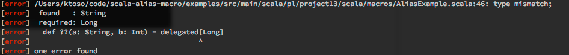

scala macro method alias
========================
*scala macro method alias* makes it possible to delegate to other methods without actually writing the delegation code.

Background
----------
The idea came up during a Scala User Group meetup after JFokus (Stockholm) where we were discussing how Akka has
to maintain 2 APIs at the same time - an example would be `tell` and `!` (where `tell` is referred to as "Java API").
√ictor jokingly said that a `@delegate` annotation would be fun, I came back to this idea while me and my friend were waiting for our plane back home to Poland. Turns out it's doable and doesn't even look all too bad - see for yourself.

So to keep it in one sentence: This macro allows you to easily (without the boilerplate of passing around the input arguments) delegate from one method to another. Imagine you're supporting multiple API which do the same thing, or you've deprecated one of the methods and now keep routing it to the new implementation.

Usage
=====
The project is synced with Sonatype OSS as well as Maven Central.

Dependency in *SBT* format:

```scala
libraryDependencies += "pl.project13.scala" %% "macro-method-alias" % "1.0"
```

Dependency in *Maven* format:

```xml
<dependency>
  <groupId>pl.project13.scala</groupId>
  <artifactId>macro-method-alias_2.10</artifactId>
  <version>1.0</version>
</dependency>
```

Examples
========

First, import the macro:

```scala
import pl.project13.scala.macros.Alias._
```


Suggested style: aliasFor method
--------------------------------
There are two ways to delegate using macro-delegate. One of them is the `aliasFor` method:

```scala
// delegation code will be generated automatically

def tell(name: String) = ???

def !(name: String) = aliasFor { tell _ }
```


Delegation of up to 22 params is supported.

Annotation style: @aliasFor + delegated[ReturnType]
---------------------------------------------------
The other style allows you to define the delegate as annotation - which makes it more visible and also documentable that this method will only
delegate calls to the other implementation.

It has the downside that the implementation of this method has to explicitly type the return type, as in: `delegated[Int]`.


Nice error messages
-------------------
I tried to make it as safe as possible - thus the macro will abort compilation if it detects the types of the
delegator and delegate don't match, or if you forget to include the annotation when using `delegated` mode:

Error when you forget to add the `@aliasFor` annotation when using `delegated`:


Error when you type the wrong type into `delegated`:


But well, the safest way is to use the *suggested style* anyway... :-)


Required Scala version
======================

* Scala 2.10+

Shameless plug
==============
I'm one of the leads of the Kraków Scala User Group (as well as JUG) - check out our meetups!

http://krakowscala.pl && http://meetup.java.pl

License
=======
I hereby release this under the **Apache 2 License**.
