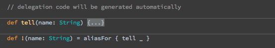
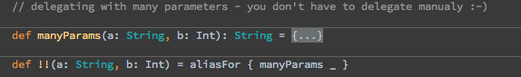

scala-macro-delegate
====================
scala-macro-delegate makes it possible to delegate to other methods without actually writing the delegation code.

The idea came up during a Scala User Group meetup after JFokus where we were discussing how Akka has
to maintain 2 APIs at the same time - an example would be `tell` and `!` (where `tell` is referred to as "Java API").
√ictor jokingly said that a `@delegate` annotation would be fun, I came back to this idea while me and my friend were
waiting for our plane back home to Poland. Turns out it's doable and doesn't even look all too bad - see for yourself.

Usage
=====
The code will be on Maven central soon...

Examples
========

Requirements
============

* Scala 2.10

Shameless plug
==============
I'm one of the leads of the Kraków Scala User Group, check out our meetups! http://krakowscala.pl
(and of the JUG and a few others too...)

License
=======
I hereby release this under the **Apache 2 License**.
